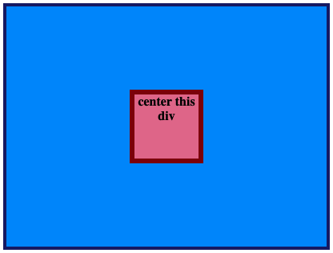

# ЦЕНТРИРУЙТЕ ЭТОТ DIV

Это просто, но это то, что вам придется делать ВСЕГДА. Лучше сделать это сейчас.

Вам нужно всего лишь центрировать красный div внутри синего контейнера.

## Желаемый результат

### Проверка
- Красный div находится в центре?
- Вы использовали _только_ flexbox для его центрирования?

